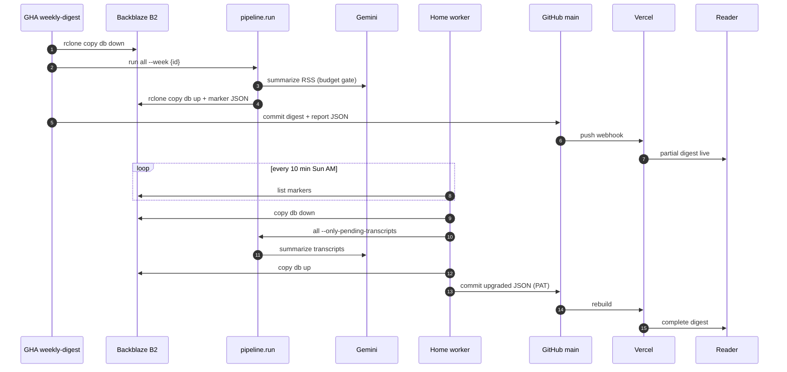

# Phase 5: Ops & Automation — Research

**Researched:** 2026-05-24  
**Domain:** Unattended weekly pipeline automation (GHA cron + home Docker worker + B2 rendezvous + Vercel publish + spend caps + heartbeat)  
**Confidence:** HIGH (locked CONTEXT + existing code seams); MEDIUM (first-live timing UAT for DST/B2 latency)

## Summary

Phase 5 wraps the Phase 1–4 pipeline in a **cloud-primary, home-narrow** automation shell. GitHub Actions runs the full weekly job on a schedule; a residential-IP Docker worker drains YouTube transcripts via Backblaze B2 marker-file rendezvous; Vercel rebuilds on every git push with no deploy hook; Healthchecks.io plus a Monday sentinel cover silent failures; and the existing `WeekBudget` machinery extends to a **cross-run $1/week hard cap** with a new `deferred_budget` sentinel (LOCKED-01 in-place routing).

The codebase already has the critical seams: `pipeline/run.py` CLI (`all`, `--only-pending-transcripts`), `WeekBudget` halt gates in `orchestrator.py`, `partition._IN_PLACE_TRANSIENT_STATUSES`, `write_pipeline_report` → `web/src/content/reports/`, and Astro content collections in `web/src/content.config.ts`. Phase 5 adds **workflow YAML**, **worker/**, **persistent weekly spend loading**, **deferred item marking**, **`--retry-transient-only`**, **ET week bounds**, and **`StatusBanner.astro`**.

**Primary recommendation:** Plan as **six vertical MVP slices** (manual GHA commit path → B2 sync + marker → budget/deferred/banner → daily retry → home worker + GHCR image → Healthchecks + sentinel), each proving an end-to-end operator or reader outcome before layering the next.

<user_constraints>
## User Constraints (from CONTEXT.md)

### Locked Decisions

- **D-B1 — GHA cron:** `.github/workflows/weekly-digest.yml`, `schedule: cron: '0 10 * * 0'` (single UTC; ±1h ET drift accepted), `workflow_dispatch`, `permissions: contents: write`, `uv` for Python, Healthchecks start/end pings.
- **D-B2 — Vercel Hobby + GitHub integration:** Root `web/`, `pnpm`, no deploy hook, no `.vercel/` in repo.
- **D-B3 — Backblaze B2 + rclone:** Bucket `aidigest-state`, paths `db/aidigest.db` and `markers/cron-complete-{week_id}.json`.
- **D-B4 — Mon–Sat daily-retry.yml:** `cron: '0 10 * * 1-6'`, transient LLM failures only, same weekly spend counter.
- **D-B5a — Multi-arch Docker worker:** `worker/` + GHCR via `build-worker-image.yml`.
- **D-B5b — B2 marker rendezvous** (not self-hosted GHA runner).
- **D-B6a — Reader promise:** Complete digest by Sun 07:00 ET; banner states completeness.
- **D-B6b — Week boundary:** Sun 00:00 ET – Sat 23:59 ET; `week_id` stays ISO.
- **D-B7 — Healthchecks.io:** Three checks + GHA failure email + Monday sentinel.
- **D-B8 — Secret hygiene:** Repo secrets (cloud) + host `.env` (worker) + fine-grained PAT (`contents:write`, 1-year) + leak-recovery runbook; no pre-commit gitleaks.
- **D-B9 — Spend caps:** $1/week app-side (`deferred_budget` sentinel, no auto-backfill) + $10/month GCP billing budget (out of repo).

### Claude's Discretion

- Exact CLI flag name for daily retry (CONTEXT suggests `--retry-transient-only`).
- `week_bounds` vs new `week_bounds_et()` vs parameter — research recommends below.
- `StatusBanner.astro` naming and exact banner copy variants.
- Whether `--backfill-deferred` stub appears in help only (deferred v1.5).

### Deferred Ideas (OUT OF SCOPE)

- Self-hosted GHA runner, Discord webhooks, custom domain, auto-backfill cap-deferred items, pre-commit gitleaks, calendar PAT reminder, real-time observability (Datadog), per-source spend caps, multi-host worker HA.
</user_constraints>

<phase_requirements>
## Phase Requirements

| ID | Description | Research Support |
|----|-------------|------------------|
| OPS-01 | Scheduled weekly cadence without manual intervention | D-B1 GHA cron + B2 handoff; `weekly-digest.yml` pattern in Code Examples |
| OPS-02 | Manual trigger for testing/recovery | `workflow_dispatch` on all three workflows; dry-run doc in `worker/README.md` |
| OPS-03 | Free/near-free host auto-deploys on digest commit | D-B2 Vercel Git integration; no deploy hook — Standard Stack |
| OPS-04 | Secrets never committed | D-B8 three layers; rclone.conf materialization at runtime; `.env.example` only |
| OPS-05 | LLM hard cap halts work, still publishes partial digest | Extend `WeekBudget` + `_mark_deferred_budget`; `deferred_budget` in `_IN_PLACE_TRANSIENT_STATUSES`; existing `test_budget_halt.py` pattern |
| OBS-03 | Heartbeat / last-run visible; missed week obvious ≤24h | `StatusBanner.astro` + Healthchecks + Monday sentinel; digest `updated_at` already in Header |
</phase_requirements>

## Architectural Responsibility Map

| Capability | Primary Tier | Secondary Tier | Rationale |
|------------|-------------|----------------|-----------|
| Weekly cron / daily retry / sentinel | CI (GitHub Actions) | — | Scheduled batch; native git commit via `GITHUB_TOKEN` |
| Pipeline ingest→render | GHA hosted runner (Python) | Home worker (transcripts only) | Cloud IPs blocked for YouTube transcripts (PITFALLS #7) |
| Shared SQLite rendezvous | Object storage (Backblaze B2) | — | File-sync problem; not a network DB |
| Static site publish | CDN/host (Vercel) | GitHub (content trigger) | Vercel watches repo; push = build |
| Spend cap enforcement | API/batch (Python `WeekBudget`) | SQLite `pipeline_runs` aggregate | Gate before each LLM call; persist spend across runs |
| Reader completeness signal | Static site (Astro `StatusBanner`) | Digest/report JSON emitters | OBS-03 is reader-surface; data from committed JSON |
| Heartbeat / alerting | External SaaS (Healthchecks.io) | GHA email on workflow failure | Ping protocol is HTTP curl from CI/worker |
| Secret storage | GitHub Secrets + host `.env` | — | OPS-04; PAT scoped to one repo for worker commits |

## Project Constraints (from `.cursor/rules/`)

- **LOCKED-01 (gsd.mdc / locked-directives.mdc):** Footer = `thin` only; all other degraded statuses in main feed with `QUOTA_BODY_COPY`. Phase 5 **must** add `deferred_budget` to `_IN_PLACE_TRANSIENT_STATUSES` and amend `LOCKED-DIRECTIVES.md` together — not silent default routing.
- **Pre-public-release Privacy Sweep:** Generic terminology in workflows, Dockerfiles, READMEs — no operator-identifying hardware/network detail.
- **D-22 discoverability:** New flags (`--retry-transient-only`, env knobs) need README + `--help` + UAT.
- **D-24 plain English on reader surface:** Banner uses "complete" / "filling in N videos" / "partial — N items skipped" — never expose `deferred_budget` string to readers.
- **MVP mode:** Vertical slices only — no "all workflows" horizontal plan without a runnable path per slice.

---

## Standard Stack

### Core (locked — do not substitute)

| Component | Version / shape | Purpose | Why locked |
|-----------|-----------------|---------|------------|
| **GitHub Actions** | Ubuntu `ubuntu-latest` | Sunday cron, Mon–Sat retry, Monday sentinel, GHCR build | D-B1; free for public repos [CITED: docs.github.com Actions] |
| **Vercel Hobby** | GitHub integration, root `web/` | Auto-deploy on push | D-B2 |
| **Backblaze B2 + rclone** | App key scoped to one bucket | SQLite + marker rendezvous | D-B3 [CITED: rclone.org/b2] |
| **Docker + buildx** | `linux/amd64`, `linux/arm64` | Home worker image on GHCR | D-B5a [CITED: docs.docker.com GHA multi-platform] |
| **Healthchecks.io** | 3 ping URLs as secrets | Missed-run detection | D-B7 [CITED: healthchecks.io/docs/http_api] |
| **Fine-grained PAT** | `contents: write`, 1 repo | Worker git push | D-B8 [CITED: docs.github.com PAT] |
| **Existing `WeekBudget`** | Extend, don't replace | $1/week cap | D-B9; `pipeline/budget.py` D-60 |
| **uv** | Project package manager | GHA Python install | Already used in repo |

### Supporting (workflow tooling)

| Tool | Version | Purpose |
|------|---------|---------|
| `docker/setup-qemu-action@v4` | Official | ARM emulation on GHA |
| `docker/setup-buildx-action@v4` | Official | Multi-arch manifest |
| `docker/build-push-action@v7` | Official | Build + push to GHCR |
| `docker/login-action@v4` | Official | GHCR auth with `GITHUB_TOKEN` |
| `curl` | Runner preinstalled | Healthchecks pings |
| `rclone` | apt or static binary | B2 copy (not sync for DB handoff) |

### Alternatives Considered (rejected in discuss — do not replan)

| Instead of | Rejected | Reason |
|------------|----------|--------|
| GHA cron | Cloudflare Workers / Render cron | No native Python; extra accounts |
| Vercel | Cloudflare Pages (STACK.md default) | Operator familiarity (D-B2) |
| B2 marker | Self-hosted GHA runner | Public-repo fork PR attack surface (D-B5b) |
| GitHub secret scanning + revoke | pre-commit gitleaks | D-B8a operator choice |

**Installation:** No new Python/npm packages required for core automation. Worker image installs existing `pyproject.toml` deps + `rclone` via apt in Dockerfile.

---

## Package Legitimacy Audit

> Phase 5 does not introduce new PyPI/npm runtime dependencies. Workflow actions use official Docker and GitHub-maintained actions.

| Package / action | Registry | slopcheck | Disposition |
|------------------|----------|-----------|-------------|
| `docker/build-push-action` | GitHub (docker org) | N/A (not npm) | Approved — official |
| `docker/login-action` | GitHub (docker org) | N/A | Approved |
| `docker/setup-buildx-action` | GitHub (docker org) | N/A | Approved |
| `docker/setup-qemu-action` | GitHub (docker org) | N/A | Approved |
| `rclone` (apt) | Ubuntu packages | N/A | Approved — install from distro or rclone.org binary |

**Packages removed due to slopcheck [SLOP]:** none  
**Packages flagged [SUS]:** none

---

## Architecture Patterns

### System Architecture Diagram



### Recommended Project Structure

```
.github/workflows/
  weekly-digest.yml      # Sun cron + dispatch
  daily-retry.yml        # Mon–Sat transient retry
  sentinel.yml           # Mon verification + HC ping
  build-worker-image.yml # worker/** → GHCR
worker/
  Dockerfile
  docker-compose.yml
  entrypoint.sh          # poll loop
  README.md
  .env.example
  rclone.conf.example
  setup-healthchecks.md
pipeline/
  budget.py              # + cross-run spend load
  week.py                # + week_bounds_et / active_digest_week
  run.py                 # + --retry-transient-only
  orchestrator.py        # + marker write hook, deferred marking
  render/partition.py    # + deferred_budget in _IN_PLACE...
web/src/components/
  StatusBanner.astro     # below Header
.planning/runbooks/
  leak-recovery.md       # exists
```

### Pattern 1: GHA cron with `contents: write` commit

**What:** Top-level `permissions: contents: write` (or job-level) so `GITHUB_TOKEN` can push digest JSON.  
**When:** Any workflow that commits artifacts.  
**Note:** Default `GITHUB_TOKEN` is read-only for `contents` on many orgs — explicit write is required [CITED: docs.github.com workflow-syntax permissions].

```yaml
permissions:
  contents: write

steps:
  - uses: actions/checkout@v4
  - run: |
      git config user.name "github-actions[bot]"
      git config user.email "41898282+github-actions[bot]@users.noreply.github.com"
      git add web/src/content/digests/ web/src/content/reports/
      git diff --staged --quiet || git commit -m "chore(digest): weekly ${WEEK_ID}"
      git push
```

### Pattern 2: Materialize `rclone.conf` from secrets (never commit)

**What:** Write config at job/container start from env; use `rclone copy` for single-file DB transfer.  
**When:** Both cron and home worker B2 access.  
**Why `copy` not `sync`:** `sync` deletes destination extras — dangerous for shared bucket with markers + DB [CITED: rclone.org/b2, Backblaze docs].

```bash
mkdir -p ~/.config/rclone
cat > ~/.config/rclone/rclone.conf <<EOF
[b2]
type = b2
account = ${B2_KEY_ID}
key = ${B2_APPLICATION_KEY}
EOF
chmod 600 ~/.config/rclone/rclone.conf
rclone copy b2:aidigest-state/db/aidigest.db data/aidigest.db
# after run:
rclone copy data/aidigest.db b2:aidigest-state/db/aidigest.db
rclone copy markers/cron-complete-${WEEK_ID}.json b2:aidigest-state/markers/
```

**B2 key idiom:** Use **Application Key ID** as `account`, **Application Key** as `key` — not master Account ID (401 errors) [VERIFIED: rclone.org/b2].

### Pattern 3: Multi-arch GHCR publish

**What:** QEMU + buildx + push with `GITHUB_TOKEN`; tag `:latest` and `:sha-{short}`.  
**Permissions:** `packages: write` + `contents: read` for GHCR [CITED: docs.github.com packages + GITHUB_TOKEN].

```yaml
permissions:
  contents: read
  packages: write

steps:
  - uses: docker/setup-qemu-action@v4
  - uses: docker/setup-buildx-action@v4
  - uses: docker/login-action@v4
    with:
      registry: ghcr.io
      username: ${{ github.actor }}
      password: ${{ secrets.GITHUB_TOKEN }}
  - uses: docker/build-push-action@v7
    with:
      context: worker
      platforms: linux/amd64,linux/arm64
      push: true
      tags: |
        ghcr.io/${{ github.repository_owner }}/aidigest-worker:latest
        ghcr.io/${{ github.repository_owner }}/aidigest-worker:sha-${{ github.sha }}
```

### Pattern 4: Healthchecks ping sequence

**What:** `/start` at job start; success POST with body at end; `/fail` or exit-code URL on failure.  
**Grace windows (D-B7 starting points):**

| Check | Expected ping | Suggested grace | Miss alert |
|-------|---------------|-----------------|------------|
| `weekly-cron` | Sun ~05:00 ET start, ~06:00 ET end | 15–30 min | Sun 06:00 ET |
| `weekly-home-worker` | After marker seen | 30–60 min | Sun 09:00 ET |
| `weekly-sentinel` | Mon 08:00 ET | 15 min | Mon morning email |

```bash
curl -fsS -m 10 --retry 3 "${HEALTHCHECK_CRON_URL}/start"
# ... pipeline ...
curl -fsS -m 10 --retry 3 --data-raw "spent_usd=${SPEND}" "${HEALTHCHECK_CRON_URL}"
# on failure:
curl -fsS -m 10 "${HEALTHCHECK_CRON_URL}/fail"
```

[CITED: healthchecks.io/docs/http_api]

### Anti-Patterns to Avoid

- **`rclone sync` on shared bucket** — can delete marker files or stale DB paths.
- **Self-hosted runner for v1** — fork PR code execution on home network (D-B5b).
- **Vercel deploy hook from GHA** — redundant with Git integration (D-B2); doubles secret surface.
- **Committing `aidigest.db` to git** — binary growth; rejected in D-B3.
- **Retrying `deferred_budget` items in daily-retry** — cap hits are anomaly signals (D-B9).
- **Changing default `week_bounds()` semantics in place** — breaks 175+ tests and W19/W21 archive semantics; add parallel ET API.

---

## Don't Hand-Roll

| Problem | Don't Build | Use Instead | Why |
|---------|-------------|-------------|-----|
| Cron scheduling | Custom sleep loop on home server | GHA `on.schedule` + optional `timezone:` | Managed, audit trail, dispatch |
| DB file sync between cloud/home | Custom HTTP upload server | B2 + rclone copy | One bucket, two clients, marker handoff |
| Container registry | Self-hosted registry | GHCR + `GITHUB_TOKEN` | Free for public repos |
| Missed-run detection | Custom cron monitor | Healthchecks.io | Purpose-built grace/alert |
| Secret leak detection | Local gitleaks hook (rejected) | GitHub push protection + secret scanning | D-B8a |
| Multi-arch builds | Per-arch Dockerfiles | buildx + QEMU | Standard GHA pattern |
| ET/DST cron math | Manual UTC offset tables | `timezone: America/New_York` **or** locked `0 10 * * 0` | See GHA cron section |

---

## Deep-Dive Findings (10 requested topics)

### 1. GHA cron pinning + DST + `contents: write`

**Locked decision (D-B1):** Single UTC expression `0 10 * * 0` — intended ~05:00 ET but drifts ±1h across DST:

| Period | UTC offset | Local time at 10:00 UTC |
|--------|------------|-------------------------|
| EST (Nov–Mar) | UTC−5 | **05:00 ET** |
| EDT (Mar–Nov) | UTC−4 | **06:00 ET** |

GitHub documents that schedules default to UTC but **now support optional `timezone`** with IANA names (e.g. `America/New_York`), including DST spring-forward skip behavior [CITED: docs.github.com workflow-syntax `on.schedule`]. D-B1 explicitly accepts UTC drift; UAT on DST boundary (listed in CONTEXT deferred watch) decides if migration to timezone-aware schedule is worth a follow-up — **planner must not switch to timezone without user unlock of D-B1**.

**Additional GHA realities:**
- Scheduled runs may slip **5–30 minutes** under load [MEDIUM: community reports].
- Minimum interval **5 minutes** between schedules.
- `permissions: contents: write` at workflow or job level required for artifact commits; org default may be read-only [CITED: docs.github.com GITHUB_TOKEN permissions].

**Optional future shape (not v1 unless D-B1 unlocked):**

```yaml
on:
  schedule:
    - cron: "0 5 * * 0"
      timezone: "America/New_York"
```

### 2. Backblaze B2 + rclone idiom

- **Free tier:** 10 GB storage free; egress free up to **3× average monthly stored bytes**, then $0.01/GB [CITED: backblaze.com/cloud-storage/pricing]. At ~2 MB DB × ~4 copies/day × 30 days ≪ 3× storage — **ample headroom** for v1.
- **Config at runtime:** `B2_KEY_ID` → rclone `account`; `B2_APPLICATION_KEY` → `key` [VERIFIED: rclone.org/b2 Application Keys section].
- **Commands:** `rclone copy` for `db/aidigest.db` and marker JSON; `rclone ls b2:aidigest-state/markers/` for worker poll.
- **Marker body:** `{"week_id":"2026-W22","completed_at":"2026-05-25T10:38:14Z"}` — worker validates `week_id` before processing (D-B5b).
- **Worker deletes marker after success** to prevent duplicate processing (idempotent re-run = no marker → exit).

### 3. Multi-arch Docker → GHCR minimal workflow

See Pattern 3. Tag strategy: **`latest`** + **`sha-${GITHUB_SHA::7}`** (short SHA via shell substring). Trigger `build-worker-image.yml` on `push` to `worker/**` and `workflow_dispatch`. Image is **not** used by Sunday cron — only home worker (D-B5a).

### 4. Healthchecks.io ping protocol

| Signal | URL suffix | Body |
|--------|------------|------|
| Start | `/start` | optional POST body |
| Success | (base URL) | POST `spent_usd=0.08` etc. |
| Failure | `/fail` | optional reason |
| Exit code | `/$?` | 0=success, non-zero=fail |

Ping URLs are **opaque secrets** — treat like passwords; regenerate via dashboard on leak (runbook step 1). Store as `HEALTHCHECK_CRON_URL`, `HEALTHCHECK_WORKER_URL`, `HEALTHCHECK_SENTINEL_URL`.

### 5. Fine-grained PAT (`contents:write`)

**Issuance flow:** GitHub Settings → Developer settings → Fine-grained tokens → Generate → Resource owner = user → Repository access = **only this repo** → Permissions → **Contents: Read and write** → Expiration **1 year** [CITED: docs.github.com managing PATs].

Worker uses PAT as `GITHUB_TOKEN` in `.env` for `git push`. Cron uses built-in `GITHUB_TOKEN` (no PAT in repo secrets for cloud commits).

### 6. GitHub native secret scanning

**What it catches:** 200+ token patterns; scans git history on push; **push protection** blocks many secrets on public repos (enabled by default for new public repos since 2024) [CITED: github.blog secret scanning changelog].

**Operator notification:** Email + Security tab alerts; partner secrets may be auto-revoked at provider; PAT on-demand revocation available from alert (Oct 2024 beta) [CITED: github.blog PAT revocation changelog].

**Post-leak step 1 trigger:** Secret scanning alert email **or** push protection block **or** operator discovery — runbook `.planning/runbooks/leak-recovery.md` already documents revoke → rotate → update secrets → audit → no force-push.

### 7. Vercel + Astro auto-deploy

- **No deploy hook required** when GitHub integration is connected — push to default branch triggers production build (D-B2) [CITED: vercel.com/docs/monorepos].
- **Root directory:** `web/` in Vercel project settings.
- **Package manager:** Vercel detects `pnpm-lock.yaml` at repo root; `web/pnpm-workspace.yaml` exists with `allowBuilds` for native deps.
- **Build command:** Default Astro — `pnpm build` in `web/` (scripts in `web/package.json`).
- **Monorepo note:** If Python root and `web/` coexist, setting Root Directory to `web/` isolates the Astro project — no Turborepo required for v1.

### 8. `pipeline/budget.py` extension surface

**Existing `WeekBudget` (in-memory per run):**

| Function / method | Role | Phase 5 change |
|-------------------|------|----------------|
| `WeekBudget.from_config()` | Load cap from `config/digest.yaml` `hard_stop_usd` (default **2.0**) | Load **`HARD_CAP_USD` env** (default **1.0**); seed `spent_usd` from DB aggregate |
| `can_afford()` | Pre-call gate | Unchanged logic; runs with loaded cumulative spend |
| `record_spend()` | After each LLM call | Unchanged |
| `halt_if_over_cap()` | Sets `halted`, `halted_at_stage` | Unchanged |
| `meta_stages_allowed()` | Meta after summarize halt | Unchanged (D-60) |

**Orchestrator insertion points (already pass `budget`):**

- `_summarize_week_items` — lines ~389–398: `can_afford` → `halt_if_over_cap` → **`break`** today; Phase 5 adds **`_mark_remaining_deferred_budget()`** after break for unprocessed canonical items.
- `_categorize_week_clusters`, `_rank_week_clusters`, `_rollup_*` — existing halt gates (~533, ~650, ~838).
- `run_all` / `run_summarize` / etc. — construct `WeekBudget.from_config(cap_override=max_cost_usd, conn=conn, week_id=week_id)`.

**Cross-run persistence (D-09 / D-69 — not a new column required for v1):**

```sql
SELECT COALESCE(SUM(cost_usd_estimate), 0.0) AS spent
  FROM pipeline_runs
 WHERE week_id = ?
   AND status IN ('success', 'partial');
```

Add helper `get_cumulative_week_spend_usd(conn, week_id) -> float` in `budget.py`; call from `WeekBudget.from_config` to initialize `spent_usd`. CONTEXT mentions `weekly_llm_spend_usd` — **aggregate from `pipeline_runs` is sufficient** unless planner needs O(1) lookup at scale (not v1).

**Report / banner fields:** Extend `build_pipeline_report` budget block:

```python
budget_block["hard_cap_hit"] = budget.halted
budget_block["deferred_items_count"] = counts.get("deferred_budget", 0)
```

Add `deferred_budget` to `_SUMMARY_STATUS_KEYS` in `pipeline_report.py`.

**Config change:** `config/digest.yaml` `hard_stop_usd: 1.0` (or env override only in CI).

### 9. `pipeline/week.py::week_bounds` widening — recommendation

| Option | Shape | Pros | Cons |
|--------|-------|------|------|
| A | New `week_bounds_et(week_id)` | Zero breakage of `week_bounds()` + `tests/test_week.py` | Two APIs; callers must pick |
| B | Parameter `week_bounds(week_id, style=...)` | Single entry | Risk of wrong default in existing call sites |
| C | Config knob only | Centralized | Hidden global state; easy to misconfigure locally vs CI |

**Recommendation: Option A + `active_digest_week_id(now)` helper**

- Keep `week_bounds(week_id)` as **ISO Mon–Sun UTC** (D-10, archive compat, 175 tests).
- Add `week_bounds_et(week_id) -> (start_utc, end_utc)` using `zoneinfo.ZoneInfo("America/New_York")`: Sunday 00:00:00 through Saturday 23:59:59 **for the digest window associated with that archive week**.
- Add `active_digest_week_id(reference: datetime | None = None) -> str` for cron: given Sun 05:00 ET run time, return the **`week_id` for the prior Sun–Sat ET window** (planner to define mapping rule: e.g. ISO week of the **Saturday** ending that window — document in README).
- GHA workflows call `active_digest_week_id` via `python -c` or pass `--week` computed in shell.

**Dependency:** stdlib `zoneinfo` (Python 3.12+) — no new package.

### 10. `partition.py::_IN_PLACE_TRANSIENT_STATUSES` extension

**Minimum change:**

```python
_IN_PLACE_TRANSIENT_STATUSES = frozenset({
    "quota_exhausted",
    "api_error",
    "parse_error",
    "client_init_error",
    "transcript_missing",
    "deferred_budget",  # Phase 5 — LOCKED-01 amendment
})
```

Cards use existing **`QUOTA_BODY_COPY`** for degraded body (LOCKED-01 — do not reword without unlock). Spend-cap **specific copy lives in `StatusBanner`**, not per-card (D-24).

**Emit ordering:** `digest_json.emit_digest_json` calls `_partition_cards` before serializing — **no ordering change**; new status flows through same path as `quota_exhausted`.

**Tests to update:**

| File | Change |
|------|--------|
| `tests/render/test_digest_json_partition_parity.py` | `test_all_in_place_transient_statuses_get_degraded_body` auto-covers new member via frozenset iteration |
| `tests/test_summary_status_propagation.py` | Add `deferred_budget` if status taxonomy asserted |
| `tests/budget/test_budget_halt.py` | Extend to assert `deferred_budget` rows + report `hard_cap_hit` when cap exhausted |
| New `tests/week/test_week_bounds_et.py` | ET boundary cases (DST optional) |

**Schema:** `item_summaries.summary_status` is TEXT — no migration required for new sentinel value; optional migration only if CHECK constraint exists (verify: migration 003 — unconstrained TEXT).

**LOCKED-DIRECTIVES.md:** Add `deferred_budget` to rule list and `_IN_PLACE_TRANSIENT_STATUSES` anchor (Phase 5 plan task).

---

## Common Pitfalls

### Pitfall 1: UTC cron drift vs reader promise (D-B6a)

**What goes wrong:** Cron at 10:00 UTC fires at 06:00 EDT; reader promise says complete by 07:00 ET — still OK, but **winter 05:00** vs **summer 06:00** changes partial-digest timing.  
**Avoid:** Document actual fire time in README; sentinel checks **committed files**, not clock alignment.

### Pitfall 2: B2 marker race / duplicate worker runs

**What goes wrong:** Two worker cycles process same marker.  
**Avoid:** Delete marker after successful commit; worker checks `week_id` match; processing idempotent via `--only-pending-transcripts`.

### Pitfall 3: Cap hit leaves items silently unprocessed

**What goes wrong:** Current code `break`s summarize loop without DB rows — items invisible in digest.  
**Avoid:** Insert `summary_status='deferred_budget'` rows for skipped canonical items (Phase 5 required behavior D-B9).

### Pitfall 4: `rclone sync` deletes markers

**Avoid:** **`copy` only** for DB and markers.

### Pitfall 5: GHCR push 403

**Avoid:** Job-level `permissions: packages: write`.

### Pitfall 6: Worker PAT vs cron token confusion

**Avoid:** Cron = `GITHUB_TOKEN`; worker = fine-grained PAT in `.env` only.

---

## Code Examples

### Resolve digest week in GHA (shell + Python)

```bash
WEEK_ID=$(python -c "from pipeline.week import active_digest_week_id; print(active_digest_week_id())")
python -m pipeline.run all --week "$WEEK_ID"
```

### Daily retry (new CLI surface)

```bash
python -m pipeline.run summarize --week "$WEEK_ID" --retry-transient-only
```

Implement filter in orchestrator: only re-summarize rows where `summary_status IN ('quota_exhausted','api_error','client_init_error')` — matches `classify_llm_exception` taxonomy in `pipeline/llm/exceptions.py`.

### Mark deferred on cap (orchestrator sketch)

```python
if budget is not None and not budget.can_afford(estimate_per_item, stage="summarize"):
    budget.halt_if_over_cap(stage="summarize")
    _mark_deferred_budget_for_remaining(conn, week_id=week_id, week_start=week_start, week_end=week_end, canonical_ids=canonical_ids, processed=set(summaries.keys()))
    break
```

### StatusBanner data source

Read from digest JSON / linked report:

- `pending_transcripts_count` — from `pipeline_notes` / count `transcript_status == pending_local` in cards
- `budget.hard_cap_hit`, `budget.deferred_items_count` — from report JSON (extend emitter)
- `updated_at` — already in Header

Place **above** PipelineNotes `<details>` (Phase 4 D-A4a), below `Header.astro`.

---

## MVP Vertical Slices (planning order)

| Slice | User outcome | Touches |
|-------|--------------|---------|
| **5-A** | Operator triggers workflow → digest JSON committed on branch | `weekly-digest.yml` dispatch-only, uv, pytest gate |
| **5-B** | Cron restores/parks SQLite on B2 + writes marker | rclone steps, marker JSON |
| **5-C** | Cap hit → partial digest + banner "N items skipped" | budget, deferred_budget, StatusBanner, LOCKED-01 doc |
| **5-D** | Transient LLM failures retry Mon–Sat without re-ingest | `daily-retry.yml`, `--retry-transient-only` |
| **5-E** | Home worker completes YouTube after marker | `worker/`, GHCR workflow, PAT push |
| **5-F** | Missed week emails within 24h | Healthchecks + `sentinel.yml` |

Each slice must pass existing pytest + targeted new tests before the next slice starts.

---

## Validation Architecture

### Test Framework

| Property | Value |
|----------|-------|
| Framework | pytest ≥9.0.3 (`pyproject.toml` optional dev) |
| Config file | `pyproject.toml` `[tool.pytest.ini_options]` |
| Quick run command | `pytest tests/budget/ tests/render/test_digest_json_partition_parity.py tests/test_week.py -x -q` |
| Full suite command | `pytest -q` |
| Web build gate | `cd web && pnpm build` |

### Phase Requirements → Test Map

| Req ID | Behavior | Test Type | Automated Command | File Exists? |
|--------|----------|-----------|-------------------|-------------|
| OPS-05 | Cap halts summarize; partial publish | unit/integration | `pytest tests/budget/test_budget_halt.py -x` | ✅ extend for `deferred_budget` |
| OPS-05 | `deferred_budget` routes in-place | unit | `pytest tests/render/test_digest_json_partition_parity.py -x` | ✅ auto via frozenset |
| LOCKED-01 | `deferred_budget` in `_IN_PLACE_TRANSIENT_STATUSES` | unit | `pytest tests/render/test_partition_cards_phase3.py -x` | ✅ extend |
| D-B6b | ET week bounds | unit | `pytest tests/week/test_week_bounds_et.py -x` | ❌ Wave 0 |
| OPS-01/02 | Workflow YAML valid | smoke | `actionlint .github/workflows/*.yml` (optional) | ❌ Wave 0 optional |
| OBS-03 | Banner variants | build | `cd web && pnpm build` | ❌ after StatusBanner |
| OPS-04 | No secrets in committed artifacts | grep | `git grep -E 'AIza[0-9A-Za-z-_]{35}' -- web/` (expect empty) | manual pattern |

### Sampling Rate

- **Per task commit:** `pytest tests/budget/ tests/render/ -x -q` (~15–30s)
- **Per wave merge:** `pytest -q` + `cd web && pnpm build`
- **Phase gate:** Full suite green before `/gsd-verify-work`

### Wave 0 Gaps

- [ ] `tests/week/test_week_bounds_et.py` — ET Sun–Sat boundaries + `active_digest_week_id`
- [ ] Extend `tests/budget/test_budget_halt.py` — `deferred_budget` DB rows + `hard_cap_hit` in report JSON
- [ ] `tests/render/test_status_banner.py` or snapshot in Astro build — banner copy variants (optional if build-only)
- [ ] `.github/workflows/*.yml` — created in Slice 5-A (no tests until then)
- [ ] `--retry-transient-only` tests in `tests/test_cli_phase3.py` or new `tests/test_retry_transient.py`

### Manual-Only Verifications (first 1–2 live weeks — from CONTEXT)

| Behavior | Why manual |
|----------|------------|
| DST cron fire time | Real GHA scheduler |
| B2 marker → worker latency | Residential network |
| Healthchecks grace tuning | Provider UI |
| Vercel push → live URL latency | External CDN |
| Sentinel false-positive rate | Needs production Sundays |
| Leak-recovery drill | Operator procedure |

---

## Security Domain

### Applicable ASVS Categories (Level 1)

| ASVS Category | Applies | Standard Control |
|---------------|---------|------------------|
| V2 Authentication | yes | Fine-grained PAT; `GITHUB_TOKEN` scoped via workflow `permissions` |
| V3 Session Management | no | Batch jobs only |
| V4 Access Control | yes | B2 app key scoped to one bucket; PAT one repo |
| V5 Input Validation | yes | Validate marker JSON `week_id`; Zod on report/digest fields |
| V6 Cryptography | yes | Secrets in env/secrets only; `chmod 600` on `.env` and rclone.conf |

### Known Threat Patterns

| Pattern | STRIDE | Mitigation |
|---------|--------|------------|
| Secret in public commit | Information disclosure | Push protection + scanning; runbook revoke |
| Fork PR on self-hosted runner | Elevation | Rejected — use B2 rendezvous (D-B5b) |
| Leaked PAT | Spoofing | Single-repo scope; annual rotation |
| Marker spoofing on B2 | Tampering | App key write limited to operator; marker includes week_id sanity check |
| LLM cost runaway | Denial of wallet | $1/week app cap + $10/mo GCP budget |

---

## Environment Availability

| Dependency | Required By | Available | Version | Fallback |
|------------|------------|-----------|---------|----------|
| Python 3.12+ | pipeline | ✓ (project) | ≥3.12 | — |
| uv | GHA install | ✓ (expected) | project standard | pip + venv |
| pnpm | Vercel/web build | ✓ (web/) | lockfile at web | npm |
| Docker | home worker | operator | — | Required for D-B5a |
| Backblaze B2 account | B2 sync | operator setup | — | Blocks 5-B |
| Vercel project linked | OPS-03 | operator setup | — | Manual deploy fallback |
| Healthchecks.io | D-B7 | operator signup | free tier | None for v1 |
| Gemini API key | pipeline | operator | — | — |
| `actionlint` | optional CI lint | optional | — | Skip |

**Missing with no fallback:** B2 bucket, Vercel link, Healthchecks checks, Gemini key — documented in `worker/README.md` setup.

---

## State of the Art

| Old Approach | Current Approach | Impact |
|--------------|------------------|--------|
| GHA UTC-only cron | Optional `timezone:` on schedule entries | D-B1 still uses fixed UTC; timezone available if unlocked |
| Cloudflare Pages (STACK.md) | Vercel (D-B2) | Same Astro static pattern |
| In-memory budget per run | Aggregate `pipeline_runs` for cross-run cap | Required for daily-retry + cron sharing $1/week |
| `hard_stop_usd: 2.0` | $1.0 for Phase 5 | Align config + env |

---

## Assumptions Log

| # | Claim | Section | Risk if Wrong |
|---|-------|---------|---------------|
| A1 | `pipeline_runs` SUM is sufficient for weekly spend (no new column) | budget.py | Under-count if failed runs partial-cost; mitigated by summing only success/partial |
| A2 | `summary_status` TEXT has no CHECK blocking `deferred_budget` | partition | Migration needed if CHECK exists |
| A3 | Vercel root `web/` sufficient without monorepo root install | Vercel | Build fails if web later imports repo-root packages |
| A4 | `--retry-transient-only` does not exist yet in `run.py` | CLI | Confirmed grep — must be built in Phase 5 |
| A5 | ISO `week_id` + separate ET bounds won't confuse archive readers | week.py | Edge items near boundaries may shift vs W19/W21 backfill windows |

---

## Open Questions

1. **`active_digest_week_id` mapping rule**  
   - What we know: D-B6b wants prior Sun–Sat ET at Sunday cron; `week_id` stays ISO.  
   - Unclear: ISO week of Sunday-start vs Saturday-end of window.  
   - Recommendation: ISO week of **Saturday** ending the window (label = "week ending Sat") — confirm in plan with one concrete date example.

2. **GHA `timezone:` vs locked UTC cron**  
   - D-B1 locked UTC; official docs now support IANA timezone.  
   - Recommendation: ship D-B1; file UAT note to revisit if ±1h matters to operator.

3. **Separate degraded copy for `deferred_budget` cards**  
   - CONTEXT mentions spend-cap copy on cards; LOCKED-01 locks `QUOTA_BODY_COPY` for all in-place statuses.  
   - Recommendation: banner carries spend message; cards keep `QUOTA_BODY_COPY` unless user unlocks LOCKED-01 wording.

---

## Sources

### Primary (HIGH confidence)

- [GitHub Actions workflow syntax — schedule, permissions](https://docs.github.com/en/actions/using-workflows/workflow-syntax-for-github-actions) — timezone, `contents: write`, `GITHUB_TOKEN`
- [rclone B2 backend](https://rclone.org/b2/) — Application Key ID as account, copy/sync semantics
- [Backblaze B2 pricing](https://www.backblaze.com/cloud-storage/pricing) — 10 GB free, 3× egress
- [Healthchecks.io HTTP API](https://healthchecks.io/docs/http_api/) — /start, /fail, POST body
- [GitHub fine-grained PATs](https://docs.github.com/en/authentication/keeping-your-account-and-data-secure/managing-your-personal-access-tokens)
- [Docker multi-platform GHA](https://docs.docker.com/build/ci/github-actions/multi-platform/)
- [Vercel monorepos](https://vercel.com/docs/monorepos) — root directory, pnpm detection
- Project files: `05-CONTEXT.md`, `pipeline/budget.py`, `pipeline/orchestrator.py`, `pipeline/render/partition.py`, `pipeline/reporting/pipeline_report.py`, `pipeline/week.py`, `web/src/content.config.ts`

### Secondary (MEDIUM confidence)

- [GitHub secret scanning / push protection changelogs](https://github.blog/changelog/2024-03-11-secret-scanning-and-push-protection-are-enabled-by-default-on-new-public-repositories/) — alert behavior
- [GitHub Packages + GITHUB_TOKEN](https://docs.github.com/en/packages/managing-github-packages-using-github-actions-workflows/publishing-and-installing-a-package-with-github-actions) — `packages: write`

### Tertiary (LOW — validate in UAT)

- GHA schedule delay 5–30 min under load (community reports)

---

## Metadata

**Confidence breakdown:**
- Standard stack: **HIGH** — locked in CONTEXT + official docs
- Architecture: **HIGH** — code seams verified in repo
- Pitfalls: **HIGH** — PITFALLS.md #3 #7 #1 align with design
- ET week mapping: **MEDIUM** — needs explicit rule in plan
- Live timing (DST, B2 latency): **LOW** until first production Sundays

**Research date:** 2026-05-24  
**Valid until:** ~2026-06-24 (stable infra); re-verify GHA timezone docs if D-B1 unlocked
